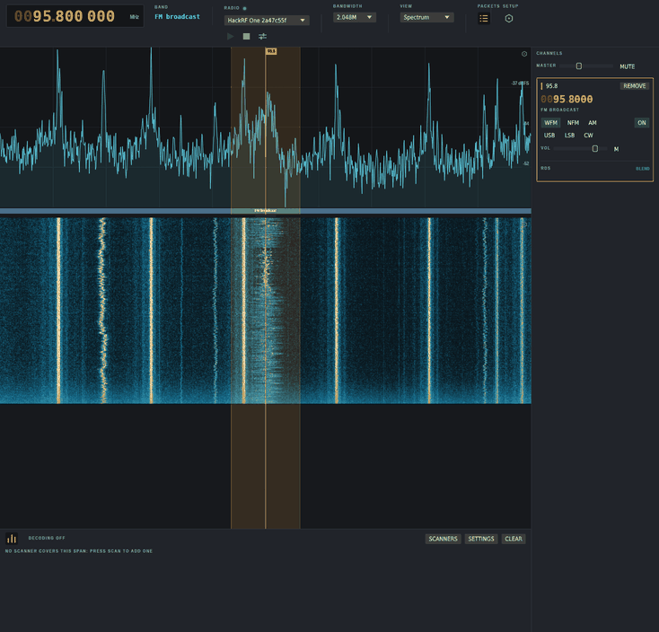

Wireshark for the radio spectrum. An OSINT instrument for the RF environment:
leave a cheap SDR on a band and WaveShark answers what is transmitting around
you, rather than what happens to be on the one frequency somebody already told
you to look at.

The questions it is built to answer are the survey ones. Which sensors are in
this building, which vehicles keep passing, which gate remotes and door
contacts are in use on this street, who is paging whom, what is flying and
sailing overhead, and which device IDs recur at what times. None of that is
reachable by tuning. It comes from covering a band continuously and keeping
everything, decoded or not.


A burst nothing recognises is still evidence, so it is logged as raw pulse
timings with its frequency, level and time. That is the raw material for the
decoder that would have claimed it, and it means a decoder written next month
can be run back over last month's traffic.

## What it identifies

Thirty-three ISM device decoders on 433, 868 and 915 MHz, all from rtl_433's
family: weather stations, thermometers, tyre pressure sensors, door contacts,
gate remotes. Most report a device ID that stays put across transmissions,
which is what turns a pile of bursts into an inventory. Anything the decoders
do not claim is reported with the coding inferred from the burst itself and the
bits sliced out under that reading, which is enough to fingerprint the same
unknown device across receptions and start reverse engineering it.

Aircraft and shipping give you position rather than presence: ADS-B and Mode S
on 1090 MHz feed a flight table and a map with callsign, altitude, speed and
track, and AIS does the same for vessels on marine VHF. APRS on 144.800
(144.390 in North America, 144.640 in Japan) covers packet stations and vehicle
trackers, including the Mic-E encoding most trackers actually send, and plots
them beside the aircraft. POCSAG pagers decode at 512, 1200 and 2400 bit/s,
with all three clocks tried at once because nothing in the signal says which it
is; paging is unencrypted and the message text comes out in clear.

Voice is there because a band survey that cannot listen is half a survey: WFM
with stereo and RDS, NFM, AM, USB, LSB and CW, several channels at a time with
their own volume and squelch, mixed together.



Receive only. Nothing here keys a radio, which suits a collection tool.
[`docs/protocols.md`](docs/protocols.md) is the roadmap: what rtl_433, a
Flipper, a PortaPack and SDRangel cover, what each would cost here, and what
transmit would need first.

## Hardware

Any RTL2832U dongle, a HackRF One, or a LimeSDR USB or Mini. A €30 RTL-SDR
does everything above; the wide spans are where a HackRF starts to matter.

## Install

Grab a build from [releases](https://github.com/v0l/waveshark/releases), Linux
x86_64 or Windows x86_64.

The Linux binary links librtlsdr instead of bundling it, so install your
distribution's package (`librtlsdr0` or `rtl-sdr`) to get the udev rules that
let you open the dongle without root. On Windows the DLLs are in the zip, but
you have to bind WinUSB to the RTL2832U with [Zadig](https://zadig.akeo.ie/)
first or nothing can open the device at all.

From source:

```sh
sudo apt install librtlsdr-dev liblimesuite-dev
cargo run --release -p app
```

Fedora calls those `rtl-sdr-devel` and `LimeSuite-devel`, Arch `rtl-sdr` and
`limesuite`, Homebrew `librtlsdr` and `limesuite`.

## Using it

Plug in a radio and press play. It opens on 433.92 MHz, which is where the
devices it decodes actually are.

Decoding does not follow the dial. Every scanner whose frequencies fall inside
the sampled span runs, all the time, so a sensor that transmits once a minute
is caught whether or not you were pointing at it, and the span is what you are
actually collecting; the dial is only where you are looking. Click the spectrum
to place a channel and start listening; drag a marker to move it, drag anywhere
else to pan, scroll to scrub the centre, hold shift to snap to the band's
channel plan.

The list along the bottom is every burst heard, with frequency, modulation,
RSSI, SNR and whatever was made of it. RSSI and SNR are both there because
either alone misleads about how close a transmitter is. Click a row for a hex
dump. `UNKNOWN` hides the unclaimed ones when a noisy band buries the decodes.

The view selector in the top bar swaps the spectrum for the flight table, the
map, or the signal chain, which draws the DSP graph as it is actually running,
with the type, rate and delay on every link. SETTINGS beside the device is the
radio's own controls: gain stages snapped to the steps the hardware has, bias
tee, crystal correction. SETUP on the right is language, country, band plan and
your position, asked once.

Where it was pointing last time is where it starts, kept as plain `key = value`
lines in `$XDG_CONFIG_HOME/waveshark/session`.

## The packet log

The log is the collection, and everything else is a view over it. Every burst
goes to `$XDG_DATA_HOME/waveshark/packets`, one file a day, on by default,
because the interesting transmission is always the one that happened before
anyone thought to press record. A receiver left on a band overnight is a
corpus.

What gets stored is what the demodulator produced, the mark and gap timings,
not the parsed fields: a parse is a conclusion, and a conclusion stored without
its evidence cannot be checked, corrected by a better decoder, or shown to have
been wrong. Timings can be decoded again next year. Replay a day with the
current decoders:

```sh
waveshark --replay 2025-08-31.wspkt
```

```
15:55:47   433.9200 MHz    88 pulses   22.5 dB  Fineoffset-WHx080  temperature_c=18 humidity_pct=61
15:55:47   433.9200 MHz   305 pulses   16.4 dB  unclaimed
```

`--packet-log <dir>` moves it, `--no-packet-log` turns it off, and it stops
appending at 512 MB.

Collecting has consequences. Pager traffic is unencrypted and routinely carries
medical and personal detail, so a pager channel left running overnight writes
readable message text to your disk, and ISM device IDs are a record of who was
where. Interception and retention are regulated differently in every
jurisdiction, and that is on you rather than on the tool.

## Recording IQ

`--record <dir>` writes every burst as an ordinary rtl_433 style capture, named
so that both WaveShark and rtl_433 can read it back:

```sh
waveshark --tune 868.3 --record captures
waveshark --replay captures
```

That is the short loop for protocol work. Capture the band once, then replay
after every change: no radio, and the same answer every time. A capture that
decodes is also a test fixture.

## Command line

`--help` has all of it. The ones worth knowing:

```
--tune <mhz>           start tuned and listening; repeat for several channels
--mode <mode>          wfm, nfm, am, usb, lsb or cw
--span <khz>           nearest span, narrowed in software if the radio cannot
--location <lat,lon>   your position, for aircraft positions from a single frame
--gain                 open the radio's own controls on start
--record [dir]         write every burst that decodes to a directory of captures
--replay [path]        decode a capture, a directory, or a packet log, and print it
--squelch-probe [mhz]  report what the squelch reads on a frequency
--soak [secs]          run for N seconds, then report CPU and span timings
--probe [mhz]          check the signal path with no display
```

## Status

Works, against real off-air RF, and checked against other people's decoders
rather than only its own: 52 recordings from rtl_433's test corpus are replayed
in CI and every field has to match what rtl_433 25.02 made of the same file,
plus ADS-B against dump1090. What is thin is coverage. Thirty-three ISM
decoders where the goal is hundreds, and the browser build is a plan
([`docs/web.md`](docs/web.md)) rather than a thing.

## Documentation

[`docs/design.md`](docs/design.md) is how it works inside and what was measured
to get there. [`docs/protocols.md`](docs/protocols.md) is the protocol roadmap,
[`docs/views.md`](docs/views.md) is how a new view attaches to the packet bus,
[`docs/web.md`](docs/web.md) is the browser plan.

## Licence

GPL-3.0-or-later, full text in [`LICENSE`](LICENSE). Why, at the end of
[`docs/design.md`](docs/design.md).
