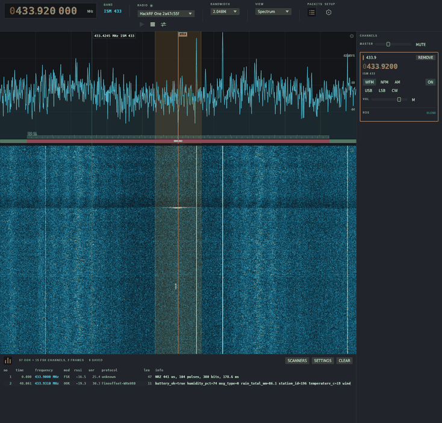

Wireshark for the radio spectrum. An OSINT tool for RF: leave a cheap SDR on a
band and it tells you what is transmitting around you, instead of what is on
the one frequency somebody already told you about.

Which sensors are in this building, which vehicles keep passing, which remotes
and door contacts are in use on this street, who is paging whom, what is
overhead. That comes from covering a band continuously and keeping everything,
decoded or not.



## What it identifies

| | where | what you get |
|---|---|---|
| ISM devices | 433, 868, 915 MHz | 33 decoders from rtl_433's family: weather stations, thermometers, TPMS, door contacts, gate remotes, mostly with a stable device ID |
| Unknown bursts | anywhere | coding inferred and bits sliced out, enough to recognise the same device again and reverse engineer it |
| Aircraft | 1090 MHz | ADS-B and Mode S into a flight table and map: callsign, altitude, speed, track, position |
| Shipping | marine VHF | AIS positions and vessel identity on the same map |
| APRS | 144.800, 144.390 US, 144.640 JP | packet stations and vehicle trackers, Mic-E included |
| Pagers | wherever you point it | POCSAG at 512, 1200 and 2400 bit/s, message text in clear |
| M17 | amateur VHF and UHF | who called whom, for how long, and packet-mode messages in full |
| Voice | any band | WFM with stereo and RDS, NFM, AM, USB, LSB, CW, several channels at once |

Receive only. Nothing here keys a radio. [`docs/protocols.md`](docs/protocols.md)
is the roadmap.

## Hardware

Any RTL2832U dongle, a HackRF One, or a LimeSDR USB or Mini. A €30 RTL-SDR does
all of the above; a HackRF buys you wider spans.

## Install

Grab a build from [releases](https://github.com/v0l/waveshark/releases), Linux
x86_64 or Windows x86_64.

The Linux binary links librtlsdr rather than bundling it, so install
`librtlsdr0` or `rtl-sdr` for the udev rules that let you open a dongle without
root. Windows ships the DLLs, but bind WinUSB to the RTL2832U with
[Zadig](https://zadig.akeo.ie/) first or nothing can open the device.

From source:

```sh
sudo apt install librtlsdr-dev liblimesuite-dev   # rtl-sdr-devel + LimeSuite-devel on Fedora
cargo run --release -p app
```

## Using it

Plug in a radio and press play. It opens on 433.92 MHz, where the devices it
decodes are.

Decoding does not follow the dial: every scanner inside the sampled span runs
all the time, so a sensor that transmits once a minute is caught whether or not
you were pointing at it. The span is what you collect; the dial is where you
look. Click the spectrum to place a channel and listen, drag to pan, scroll to
scrub, shift to snap to the band plan.

The list along the bottom is every burst heard, with frequency, modulation,
RSSI, SNR and what was made of it. Click a row for a hex dump; `UNKNOWN` hides
the unclaimed ones. The view selector swaps the spectrum for the flight table,
the map, or the live DSP graph. SETTINGS is the radio's own gain and switches,
SETUP is language, country, band plan and your position.

## The packet log

Every burst goes to `$XDG_DATA_HOME/waveshark/packets`, one file a day, on by
default, because the interesting transmission is always the one that happened
before you thought to record. What is stored is the raw mark and gap timings
rather than the parsed fields, so a better decoder can be run over it later:

```sh
waveshark --replay 2025-08-31.wspkt
```

```
15:55:47   433.9200 MHz    88 pulses   22.5 dB  Fineoffset-WHx080  temperature_c=18 humidity_pct=61
15:55:47   433.9200 MHz   305 pulses   16.4 dB  unclaimed
```

`--packet-log <dir>` moves it, `--no-packet-log` turns it off, and it stops at
512 MB.

Collecting has consequences: pager traffic carries medical and personal detail
in clear, and device IDs are a record of who was where. Interception and
retention rules differ by country and that is on you.

## Recording IQ

`--record <dir>` writes each burst as an rtl_433 style capture, so both this
and rtl_433 can read it back:

```sh
waveshark --tune 868.3 --record captures
waveshark --replay captures
```

Capture a band once, then replay after every change: no radio, same answer
every time. A capture that decodes is a test fixture.

## Command line

`--help` has the rest.

```
--tune <mhz>           start tuned and listening; repeat for several channels
--mode <mode>          wfm, nfm, am, usb, lsb or cw
--span <khz>           nearest span, narrowed in software if the radio cannot
--location <lat,lon>   your position, for aircraft positions from a single frame
--record [dir]         write every burst that decodes to a directory of captures
--replay [path]        decode a capture, a directory, or a packet log
--squelch-probe [mhz]  report what the squelch reads on a frequency
--probe [mhz]          check the signal path with no display
```

## Status

Verified against other people's decoders, not just its own: 52 recordings from
rtl_433's corpus are replayed in CI and every field must match rtl_433 25.02,
plus ADS-B against dump1090. Coverage is the thin part, thirty-three ISM
decoders where the goal is hundreds, and the browser build
([`docs/web.md`](docs/web.md)) is still a plan.

## Documentation

[`docs/design.md`](docs/design.md) is how it works inside,
[`docs/protocols.md`](docs/protocols.md) the protocol roadmap,
[`docs/views.md`](docs/views.md) how a view attaches to the packet bus.

## Licence

GPL-3.0-or-later, text in [`LICENSE`](LICENSE), reasoning at the end of
[`docs/design.md`](docs/design.md).
