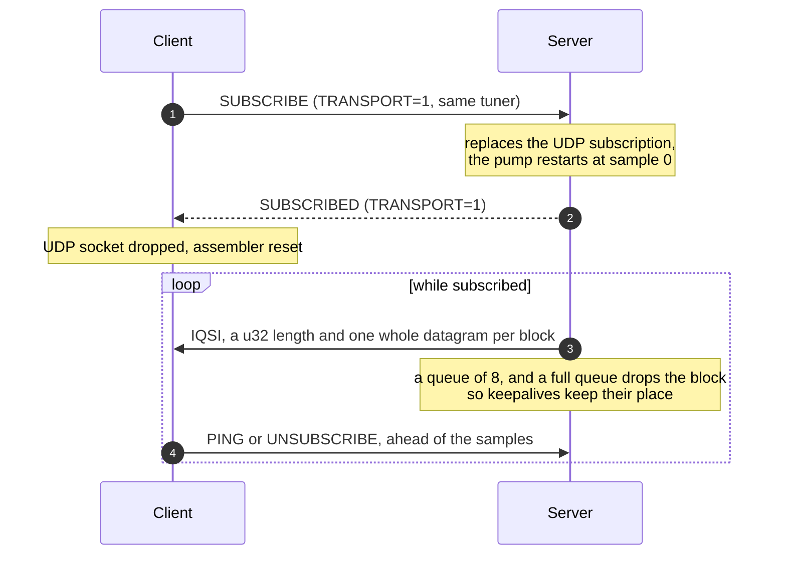
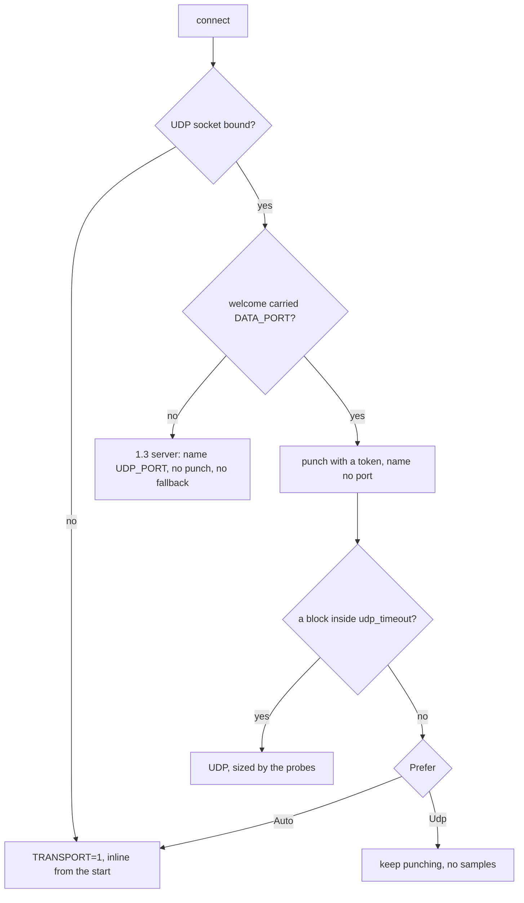

# IQStream through a NAT

How a subscriber that cannot be addressed gets its samples, and how the
server decides how big to make them. The code is `crates/iqstream`: the wire
format in `proto.rs`, the punch table and the pump in `server.rs`, the
punching and the fallback in `client.rs`. Protocol 1.4.

Three things had to be true before a client on the internet could read a
server behind an ordinary home connection. The server has to learn an address
it was never told, because a client behind NAT does not know its own. The
datagrams have to fit a path that is not 1500 bytes, because a fragment that
does not fit is dropped and MSS clamping does nothing for UDP. And where no
datagram gets through at all, which is what a symmetric NAT or a firewall
with UDP switched off gives you, the samples have to travel on the control
connection instead.

## Connecting

```mermaid
sequenceDiagram
    autonumber
    participant C as Client (behind NAT)
    participant N as NAT
    participant S as Server (TCP and UDP on one port P)

    Note over C: bind UDP 0.0.0.0:0<br/>(skipped when Prefer::Tcp)

    C->>S: TCP connect, preamble IQSC 1.4
    S-->>C: preamble IQSC 1.4
    C->>S: HELLO (CLIENT_NAME)
    S-->>C: WELCOME (STREAM..., DATA_PORT = P)
    Note over C: punch_to = peer ip : P<br/>token = mixed clock and counter

    C->>N: UDP IQSH and token
    N->>S: UDP IQSH and token, from the mapped address
    Note over S: punch_loop: a subscription holding that token<br/>is told; otherwise it is held 30 s in `early`

    C->>S: SUBSCRIBE (STREAM_ID, BIT_DEPTH, CODEC,<br/>TRANSPORT=0, PUNCH_TOKEN)
    Note over S: dest = the early punch,<br/>else the named UDP_PORT (1.3 client),<br/>else nothing yet
    S-->>C: SUBSCRIBED (TRANSPORT=0)

    loop every udp_timeout/6 until a block is heard
        C->>S: UDP IQSH and token, opening the hole
    end

    S->>C: UDP IQSP probe, payload 1228, twice
    S->>C: UDP IQSP probe, payload 1400, twice
    Note over C: only a probe that arrived is answered
    C->>S: PROBED (PROBE_SIZE = 1228)
    Note over S: payload cap raised from 1196 to 1228

    loop while subscribed
        S->>C: UDP IQSD data, fragments cut at the cap
        C->>S: PING, and a punch to hold the mapping open
    end
```

The client names no `UDP_PORT` to a 1.4 server. Behind a NAT that port is not
where anything arrives, and a server sending there is aiming samples at
whatever else is on the same network. The punch is the only address worth
having, and when it does not get through, nothing does.

## Sizing the datagrams

The cap starts at 1196 bytes of payload, which with the 36 byte data header,
8 bytes of UDP and 40 bytes of IPv6 comes to 1280 on the wire, the smallest
an IPv6 path is allowed to be. Above that the server probes: 1228 for a path
of 1312, which is PPPoE over a tagged link, and 1400 for plain Ethernet. Each
probe is exactly as heavy as the block it stands for and is sent twice, so
one lost datagram does not cost the path its real size. A probe that arrives
is answered with `PROBED`; one that does not is never mentioned, and the size
it stood for is never used. A client too old to answer keeps the 1400 byte
payload every client had before 1.4.

The sizes are pinned in `every_probe_size_fits_the_mtu_it_stands_for` in
`proto.rs`, and the fragment lengths that come out of them in
`crates/iqstream/tests/nat.rs`.

## Falling back to the control connection

`Prefer::Auto` gives UDP three seconds, spending six punches inside it. If no
block has arrived by then it subscribes again to the same tuner with
`TRANSPORT=1`, which the server treats as a replacement, and the samples come
back on the socket that already works.



An inline record carries the whole block, since the stream underneath is
already in order and cannot lose a piece of it, so nothing is fragmented and
`frag_count` is 1. The cost is head of line blocking: a reader that stops
taking its samples would otherwise hold up its own keepalives and be dropped
for it. The server writes control frames first and throws blocks away when
the queue is full, counted in `Stream::blocks_dropped`.

## What each end decides



A server that could not have its TCP port for UDP as well sends no
`DATA_PORT`. It cannot be punched, so a client names its own port as a 1.3
one does, and asking such a server for inline samples is refused.
